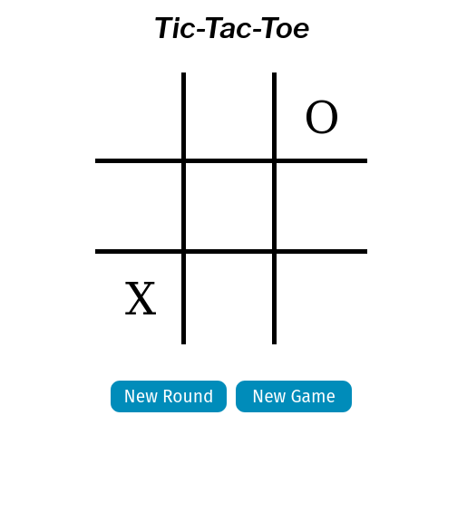

# tic-tac-toe



[Live Page](https://sebastienpj.github.io/tic-tac-toe/)

Here is my solution to the Tic-Tac-Toe project from The Odin project.

Play Tic-Tac-Toe with 2 Players or against a simple AI that makes random moves on the board. I will return to this project to implement the minimax algorithm to create an unbeatable AI.  


I used HTML, CSS/Flexbox, and Javascript to complete this project.


Topics learned/reinforced:
- Using factory functions
- The Module Pattern
- Namespacing, Scope, Closure and _this_ keyword
- Private and Public Scope
- ```.call(), .apply(), .bind()```
- DOM Manipulation:
  - Selecting elements using Javascript
  - Adding and removing content from page 
  - Adding Event Listeners to DOM elements
